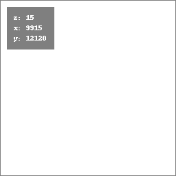
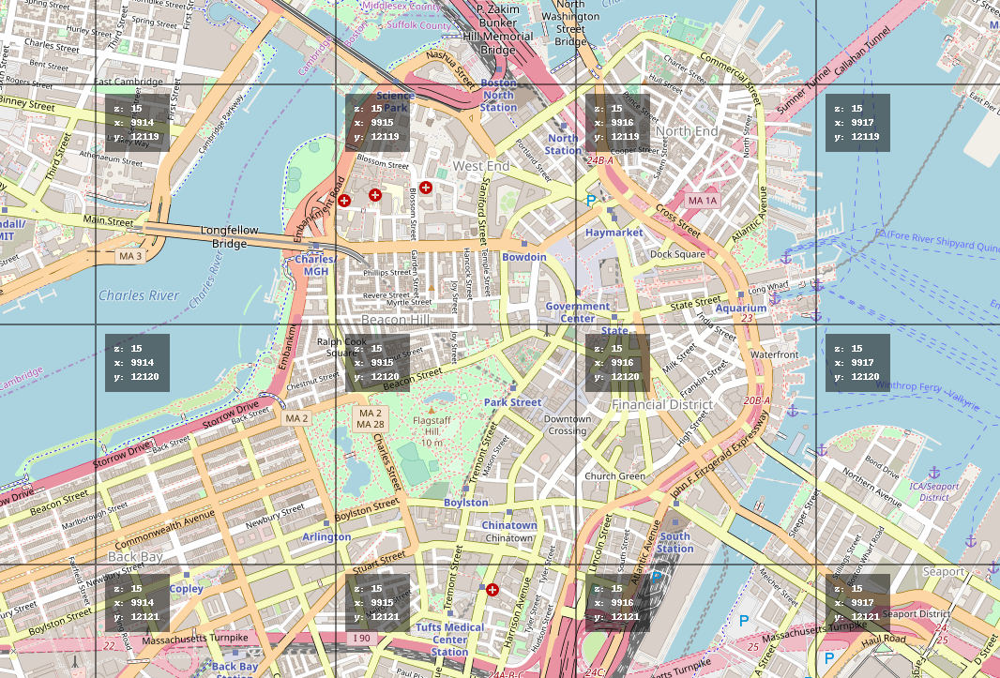

# Coordinates Tile Server

A simple tile server where the tiles show their coordinates

Tiles look like this:

You can overlay them on a map to see the coordinates of the map's tiles.

Tiles are at the url `/tiles/{z}/{x}/{y}.png`.

Run using `python main.py`

The default port is 6371, so the tiles will be at
`http://localhost:6371/tiles/{z}/{x}/{y}.png`.

A simple demo map that uses these tiles overlayed on Open Street Map is in `index.html`, so you can see it at `http://localhost:6371/`
